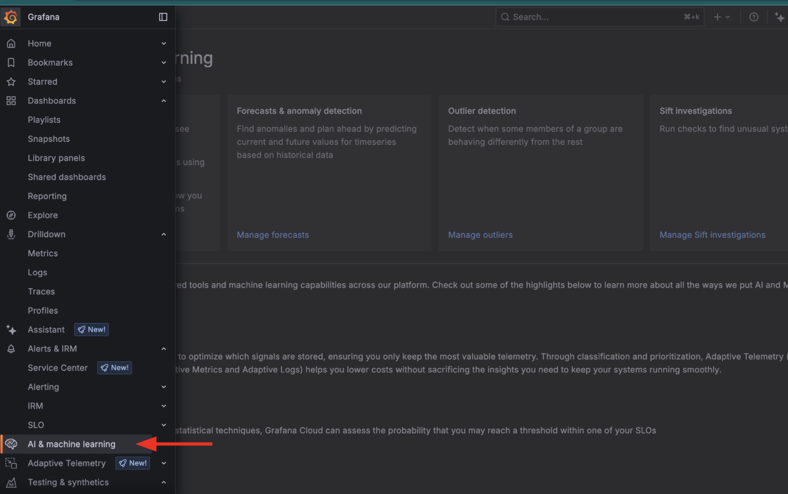
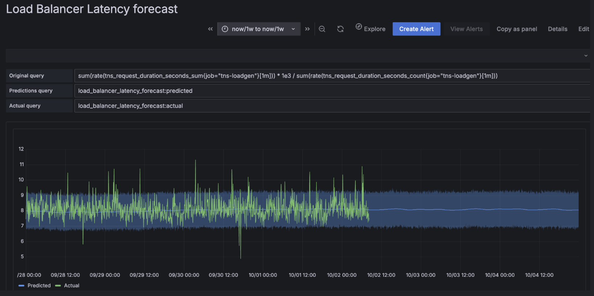
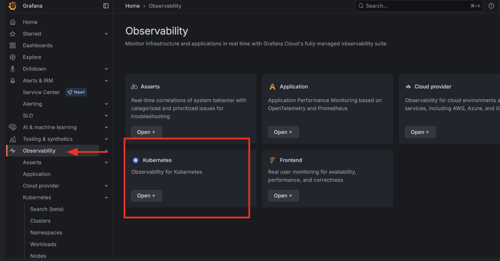
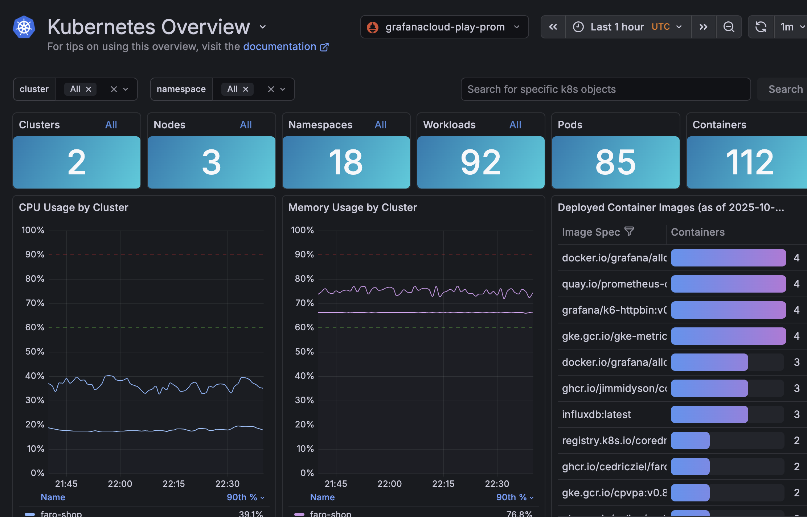

# Breakout 2 - Doing more with Metrics in Grafana Cloud

# Part 1 - Metrics forecasting and anomoly detection

Navigate to the Grafana AI & Machine learning page



From here you can see all the **AI & ML capabilities that Grafana Cloud** offers across the platform.

Spend some time here exploring some of the capabilities on offer.

<<<<<<< HEAD
For this excercise we will use the Load Balanace Average latency query we created earlier to predict unexpected increases in latency.  

To begin, Click on the Forecasts & Anomoly detection tile.
=======
For this excercise we will use the Load Balanace Average latency query we created earlier to predict unexpected increases in latency
>>>>>>> 4b72aaafd26e8cb9d661c6d20c6c9600419823ba

1. Click + New Forecast.
2. In the Query builder, choose the promethues datasource that we created earlier.
3. Run the following query:

```bash
sum(rate(tns_request_duration_seconds_sum{job="tns-loadgen"}[1m])) * 1e3 / sum(rate(tns_request_duration_seconds_count{job="tns-loadgen"}[1m]))
```

4. Click Next: Preview and tune.
5. Preview the forecast. Your series appears in green while the forecast is blue.
6. Drag the Uncertainty interval width slider to 0.8 and see how the bands in the preview get narrower.
7. Click the Advanced Model Options section header and observe the tuneable knobs.
8. Click Next: Set name and description.
9. Name your forecast Grafana Cloud Active Series and click Next: Review.
10. Review your forecast. Once you’re satisfied, click Create forecast.
11. On the Forecasts page, your forecast is ready to generate predictions when the Pending tag turns into a green Ready tag.

# View your forecast
Click View on the Grafana Cloud Active Series forecast you created in the previous section.
Change the view to an interesting time frame for your forecast. By default the view is for the current week.
Explore how the forecast matches your actual result, and be sure to include some days in the future to see how the model thinks your active series will evolve.

At the top of the screen, the UI displays your original query, as well as how you can query the forecast (grafanacloud_active_series:predicted) or actual(grafanacloud_active_series:actual) data. You can use these series to create panels or alerts.

It should look something like this:


# Use the forecast in a panel
From the view page:

1. Click the Copy as panel button in the upper right.
2. Open an the dashboard you created in the previous breakout.
3. At the top of the dashboard, click Add and select Paste panel from the dropdown.
4. Edit the new panel and view the generated queries.

# [Advanced to do later] Use the forecast in an alert
[Grafana Alerting](https://grafana.com/docs/grafana/latest/alerting/#overview-of-grafana-alerting)

1. Click the Create Alert button from either the view page or the list page.
2. In the Alert evaluation behavior section, choose a folder in which to save the alert.
3. Tune the alert conditions and labels, if desired.
4. Click Save or Save and exit to create the alert and navigate back to the previous page.


# Part 2 - Metrics for monitoring your infrastructure

Configuring, installing, connecting, and maintaining components for a Prometheus-based observability stack often involve significant domain knowledge, and can be tedious and time consuming. Grafana integrations offer you a fast and easy way to get started with minimal effort. Integrations are built with a curated set of default metrics and preconfigured Grafana dashboards, driven by Grafana Alloy deployed into your environment.

Let's see this is action.

Goto to [Grafana Play](https://play.grafana.org/) a sandbox for testing and learning Grafana that runs on Grafana Cloud.

Navigate to the Observability panel and drill into Kubernetes


# Explore using the Kubernetes structure

Kubernetes Monitoring pages reflect the hierarchy of Kubernetes objects, so you can begin at any level above containers. Main pages include lists of Clusters, namespaces, workloads, and Nodes.

For example, the Cluster main page shows the list of your Clusters. When you click on a Cluster in the list, it opens the Cluster detail page. That page shows the details for the Cluster along with a list of Nodes within that Cluster.

You can continue to drill into a Node and see the list of Pods for that Node, all the way to the container level.

**Have a PLAY!!**



For additional navigation tips, refer to [Navigation tips](https://grafana.com/docs/grafana-cloud/monitor-infrastructure/kubernetes-monitoring/navigate-k8s-monitoring/#navigation-tips) for Kubernetes Monitoring.

# Grafana integrations

**Pre-configured Prometheus and Grafana-based observability stack up and running in minutes.**

Integrations bundle Grafana Alloy configuration snippets, tailored Grafana dashboards, and alerting defaults for common observability targets like Linux hosts, Kubernetes clusters, and Nginx servers. 

Refer to Integrations reference for the current list of integrations.
[Integrations reference](https://grafana.com/docs/grafana-cloud/monitor-infrastructure/integrations/integration-reference/)


## Pop Quiz
1. What algorithm does Grafana Forecasting use?
2. What is Grafana Alloy?

## End of second breakout. Stop here!

---
```


```
## Answer to the Pop Quiz

**Grafana Forecasting uses the Prophet algorithm** for its forecasting capabilities. Prophet is a time series forecasting model developed by Facebook, designed to automatically account for features such as yearly, weekly, and daily seasonality. This allows Grafana to capture repeating patterns in your data and use them for adaptive alerting and capacity planning. Additionally, Grafana Machine Learning supports enhancements like holiday effects, where you can inform the model about specific recurring events to improve forecast accuracy. The model is retrained periodically to stay up-to-date with your latest data and patternsprometheus_build_info

**Grafana Alloy** is an open source, high-performance, vendor-neutral distribution of the OpenTelemetry Collector developed by Grafana Labs. It is designed to collect, process, and export telemetry signals—including metrics, logs, traces, and profiles—from a wide variety of sources, supporting both application and infrastructure observability needs. Alloy is fully compatible with popular open source observability standards such as OpenTelemetry and Prometheus, and it offers native pipelines for these and other telemetry formats like Loki and Pyroscope.

