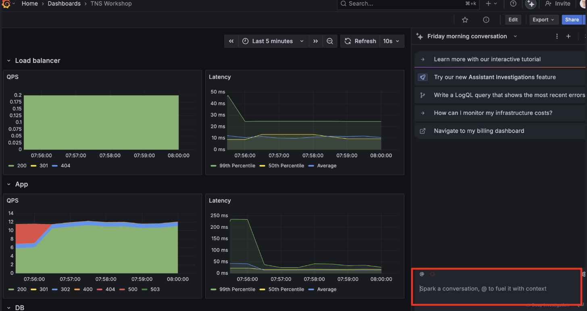

# Breakout 3 - The Grafana Assistant Challenge!

Navigate to the TNS Dashboard you created in Breakout 1, and click the Grafana Assistant button

As suggested, **Spark a conversation and fuel it with context!**. 

# Supercharge Your TNS Dashboard!
Use this opportunity to push your Grafana Assistant creation to the limit and transform your dashboard. The most spectacular entry wins a prize!

# Some ideas to get you started
1. Why are we seeing 500 errors in tns-app? (+ add panel to dashboard)
Assistant will perform a string of investigations and should run a query and panel showing the breakdown of 5xx errors in the tns-app.
ACTION: Consider adding the “All 5xx errors in tns-app” panel into the dashboard.

2. Investigate the health and error rates of tns-db service to see if it's the source of the 500 errors

3. Create a time series panel for database error rates

4. Set up an alert for when database requests are returning 500 errors more than 10% of the time.

