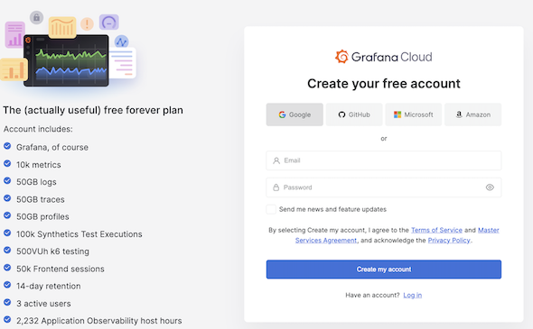
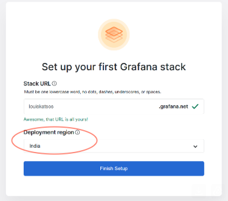
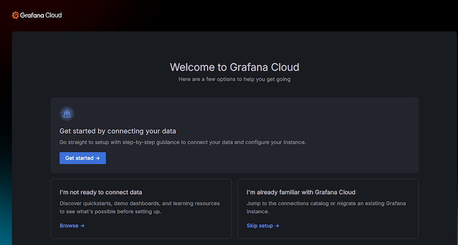

# Set up your free trial
Before you begin.  Set up your Grafana free trial.

[Create Grafana Free Trial](https://grafana.com/auth/sign-up/create-user?pg=pricing&plcmt=metrics-details&cta=create-free-account)
1. Choose your preferred login method.  This is a grafana free forever plan and you can do quite a bit with it!

2. Choose your deployment region (Somewhere close to your data e.g Hint India!)

3. Click "Get Started" 

4. That's it for now!

